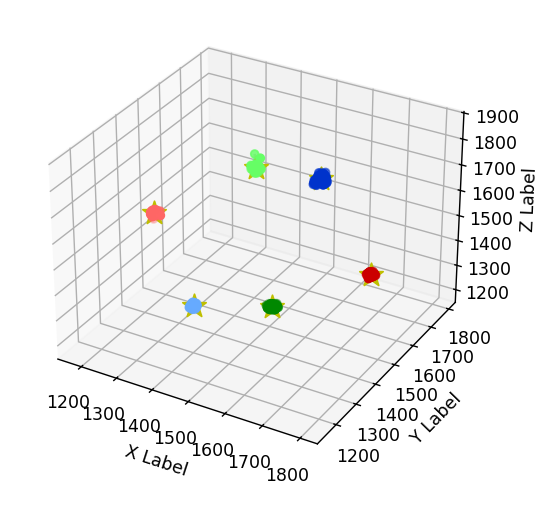
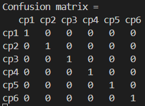

# Tietoliikenteen sovellusprojekti Syksy 2025 R25
Tietoliikenteen sovellusprojekti suoritetaan osana Tieto- ja viestintätekniikan opintoja. Projektissa mitataan kiihtyvyysanturidataa, välitetään data Rasperry Pin avulla Linux-palvelimella olevaan tietokantaan ja mittausdataa käytetään koneoppimismallin koulutuksessa.

## Laitevaatimukset
- Nordic nRF5340
- GY-61 ADXL335 3-akselin kiihtyvyysanturi
- Rasperry Pi 3
- Linux-palvelin

## Arkkitehtuuri
Kuva 1. Arkkitehtuuri kuva

## Toiminta
### Mittaus
Mittaukseen käytetään 3-akselista GY-61-kiihtyvyysanturia ja Nordicin nRF5340 devKit -alustaa. Mittaus edellyttää ohjelman luontia, joka kykenee ottamaan vastaan anturin mittaamat arvot ja lähettää ne BLE-yhteyden yli.

Mittaus tapahtuu 100 hertsin näytteistystaajuudella ja suoritetaan kuudessa eri asennossa noin 10 sekunnin ajan. Tämä tarkoittaa että kokonaisuutena mittauksesta saadaan 6000 näytettä, eli 1000 näytettä per asento. Mittaus ja lähetys tapahtuu samanaikaisesti ja mittaustiedot lähetetään BLE-notifikaationa jotka vastaanottaja tilaa.
### Tiedonsiirto
Tiedonsiirtoon käytetään BLE- ja TCP-yhteyksiä. Mittalaitteisto välittää mittaustiedon BLE:n yli rasperry pi:lle joka toimii IOT- gatewaynä ja siirtää vastaanotetun datan Linux-palvelimella olevaan tietokantaan. Tietokannasta dataa haetaan TCP-clientin avulla csv- tiedostoon.

### Hyödyntäminen
Dataa hyödynnetään K-means-koneoppimismallin kouluttamisessa. Luotu ohjelma ottaa x, y ja z pisteet, arpoo näille kuusi keskipistettä ja iteroi kunnes kekipisteet asettuvat paikoilleen. Lopuksi ohjelma piirtää kuvaajan, jossa nähdään keskipisteet sekä data pisteet (Ks. kuva 2) ja tallentaa keskipisteden sijainnin keskipisteet.h tiedostoon.

Kuva 2. Keskipisteet ja data pisteet

Keskipiste.h tiedostossa olevia keskipisteitä hyödynnetään C-ohjelmassa joka ajetaan nordicin alustalla arvaamaan anturin asento mitatuista arvoista. Mittauksen perusteella veikattua arvoa verrataan tiedettyyn asentoon ja tällä todennetaan toimiiko koneoppiminen oikein.

## Sekaannusmatriisi
 

Kuva 3. Sekaannusmatriisi, jossa yksi mittaus ja yksi veikkaus per suunta

## Tekijät
Olemme OAMK Tieto- ja viestintätekniikan laiteläheisen ohjelmoinnin 2. vuosikurssin opiskelijoita.
- Hietamäki Valtteri
- Ikäläinen Sami
