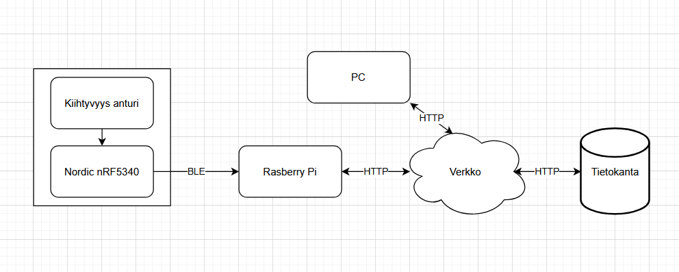

# Tietoliikenteen sovellusprojekti Syksy 2025 R25
Tietoliikenteen sovellusprojekti suoritetaan osana Tieto- ja viestintätekniikan opintoja. Projektissa mitataan kiihtyvyysanturidataa, välitetään data Rasperry Pin avulla Linux-palvelimella olevaan tietokantaan ja mittausdataa käytetään koneoppimisessa.

## Arkkitehtuuri

## Tavoitteet
### Mittaus
Mittaukseen käytetään 3-akselinen GY-61-kiihtyvyysanturia ja Nordicin nRF5340 devKit -alustaa. Mittaus edellyttää ohjelman luontia, joka kykenee ottamaan vastaan anturin mittaamat arvot ja lähettää ne BLE-yhteyden yli.

Mittaus tapahtuu 100 hertsin näyteistys taajuudella ja suoritetaan kuudessa eri asennossa noin 10 sekunnin ajan. Tämä taekoittaa että kokonaisuutena mittauksesta saadaan 6000 näytettä, eli 1000 näytettä per asento. mittaus ja lähetys tapahtuu yhden aikaisesti. Mittaus tiedot lähetetään BLE Notifikaationa jotka vastaan ottaja tilaa.

### Tiedonsiirto
Tiedon siirtoon käytetään BLE- ja TCP-yhteyksiä Mitta laitteisto välittää mittaus tiedon BLE yli rasperry pi:lle joka toimii IOT Gatewaynä ja siirtää vastaan otetun datan Linux palvelimella olevaan tietokantaan. Tietokannasta dataa haetaan TCP Clientin avulla csv tiedostoon.

### Hyödyntäminen
Kerättyä ja säilöttyä dataa hyödynnetään koneoppimismallin kouluttamisessa. Käytettävä malli on K-means algoritmi joka ottaa data setin x,y ja z pisteet ja kuusi eri keskipistettä jotka vastaavat jokaista asentoa. Nämä keskipisteet palautetaan keskipisteet.h tiedostona.

## Confucion Matrix

## Tekijät
Olemme 2. vuoden opiskelijoita OAMK Tieto- ja viestintätekniikka Laiteläheinen ohjelmointi linjalta
- Hietamäki Valtteri
- Ikäläinen Sami
