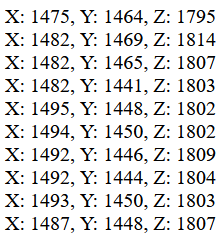

# Tietoliikenteensovellusprojekti Syksy 2025 R25

## Johdanto
Tietoliikenteensovellusprojekti suoritetaan osana 2. vuoden tieto- ja viestintätekniikan opintoja. Projektin tarkoituksena on oppia Nordicin kehitysalustan ja erityisesti Bluetooth Low Energyn käyttöä datan siirtoon. Lisäksi opitaan kiihtyvyysanturidatan käyttöä koneoppimisessa.

## Laitevaatimukset
- **Nordic nRF5340**-kehitysalusta
- **GY-61 ADXL335** 3-akselin kiihtyvyysanturi
- **Rasperry Pi 3**
- **Linux-palvelin**

## Arkkitehtuuri
 *Kuva 1. Arkkitehtuuri*

## Toiminta
### Mittaaminen
Mittaukseen käytetään 3-akselista GY-61-kiihtyvyysanturia ja Nordicin nRF5340-alustaa. Mittausta varten on luotu C-kielellä kirjoitettu ohjelma Nordicin alustalle, joka vastaanottaa kiihtyvyysanturin lukemat x-, y- ja z-ulottuvuuksista suoraan AD-muuntimelta.

 *Kuva 2. Mittalaitteisto*

Mittaus tapahtuu 100 Hz:n näytteistystaajuudella ja suoritetaan kuudessa eri asennossa noin 10 sekunnin ajan. Tämä tarkoittaa että kokonaisuutena mittauksesta saadaan 6000 näytettä, eli 1000 näytettä per asento. Mittauslukemien mukana lähetetään myös asentotieto, joka on numero väliltä 0-5 ja kukin numero vastaa yhtä asentoa. Asentotietoa tarvitaan myöhemmin mittaamaan koneoppimismallin toimivuutta. Mittaus ja lähetys tapahtuu samanaikaisesti ja mittaustiedot lähetetään BLE-notifikaationa jotka vastaanottaja (Rasperry Pi) tilaa.

### Tiedonsiirto
Tiedonsiirtoon käytetään BLE- ja TCP-yhteyksiä. Rasperry Pi:lle on tehty pythonilla ohjelma, joka yhdistää Nordicin alustaan BLE:llä. Ohjelma tilaa alustan C-koodissa määritetyn bluetooth-ominaisuuden, jonne alustaan tulevat kiihtyvyysanturilukemat tulevat. Kun lähettäminen alustalta alkaa, lähettää ohjelma mittausdatan mysql-tietokantaan virtuaaliselle linux-palvelimelle. Ohjelma hyödyntää pythonin Bleak-kirjastoa.

Mittausdatan hakemiseksi tietokannasta on tehty toinen ohjelma pythonilla, joka hakee datan PC:lle ja tallentaa datan CSV-tiedostoon, josta sitä on helppo käyttää. Ohjelma käyttää mysql-connectoria, joka mahdollistaa python-ohjelmien käyttää mysql-tietokantoja.

### Datan käyttö koneoppimiseen

#### K-Means toiminta
K-Means clustering on valvomaton koneoppimisalgoritmi, joka pyrkii löytämään datasta samankaltaisuuksia ja luokittelemalla ne pisteisiin. K tarkoittaakin algoritmin nimessä näiden pisteiden määrää. K-means toimii kaikessa yksinkertaisuudessaan seuraavasti:

1. Valitaan keskipisteiden eli **centroidien** määrä (K) ja asetetaan nämä satunnaisiin kohtiin aineistoa.

2. Jokainen datapiste ryhmitellään laskemalla etäisyys kuhunkin pisteeseen ja liitetään siihen pisteeseen, joka on lähimpänä.

3. Kun kaikki datapisteet on liitetty omiin centroideihin, lasketaan uudet centroidit laskemalla kaikkien centroidiin liitettyjen datapisteiden keskiarvo.

4. Vaiheita 2 ja 3 toistetaan kunnes centroidien sijainti ei enää muutu eli ollaan saavutettu konvergenssi.

#### K-means käytännössä

Kuten aiemmin mainittu, meidän tapauksessa algoritmille syötetään 6000 näytettä kuudesta eri kiihtyvyysanturin asennosta, eli lähdemme ajamaan algoritmiä valitsemalla kuusi centroidien määräksi.

*Kuva 3. Esimerkki datasta*

Kun algoritmi on iteroinut datan ja saanut centroidit asettumaan paikoilleen, ohjelma luo keskipisteet.h-tiedoston ja tallentaa centroidien 3D-pisteet C-taulukkoon. Lopuksi ohjelma piirtää kuvaajan, jossa nähdään keskipisteet sekä datapisteet.

*Kuva 4. Keskipisteet ja datapisteet*

#### Käyttö luokittelussa

Tuloksena saatuja datapisteitä voidaan nyt käyttää arvioimaan kiihtyvyysanturin asento laskemalla anturin mittaushetkellä olevien arvojen ero centroidien arvoihin. Mallin vastaus on se asento, johon mitattujen arvojen ero on pienin.

Sekaannusmatriiseja käytetään usein kuvaamaan koneoppimismallien kykyä tunnistaa tai ennustaa asioita. Kuvassa 5 on mallista saatu sekaannusmatriisi, jonka rivit edustavat oikeaa asentoa ja sarakkeet mallin ennustamaa asentoa.

Mallia testattiin asettamalla kiihtyvyysanturi haluttuun asentoon, asettamalla Nordicin napeista asentoa vastaava numero ja lähettämällä se ohjelmalle. 

 

*Kuva 5. Sekaannusmatriisi, jossa yksi mittaus ja yksi veikkaus per suunta*

Matriisin perusteella voidaan todeta mallin tunnistaneen erinomaisesti kiihtyvyysanturin asennon, kun luvut asettuivat kohdilleen riveiltä sekä sarakkeilta.

## Tekijät
Olemme OAMK Tieto- ja viestintätekniikan laiteläheisen ohjelmoinnin 2. vuosikurssin opiskelijoita.
- Hietamäki Valtteri
- Ikäläinen Sami
